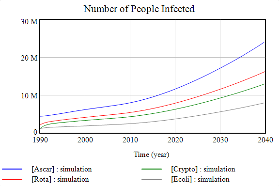

## Population Growth in Uganda
This is a simple example of modeling population growth in Uganda using system dynamics techniques. System dynamics modeling is beneficial for studying feedback loops, time delays, and other nonlinearities. To create the model, the population is divided into a small number of compartments (e.g. by age). Here, the population is divided into\:
* Infants
* PreSACs (preschool-aged children)
* SACs (school-aged children)
* Adults
* Elderly

 
Having a reliable population model is a useful foundation for many public health and policy applications. For instance, I used a version of this population model to estimate the number of Ugandans affected by various gastroenteric pathogens. After projecting those numbers into the future, I could test how different intervention strategies may plausibly affect overall morbidity and mortality rates based on this initial population model.

 

If you are beginner in continuous modeling and/or Vensim, this example may be helpful launching point for your own studies.

[View the full model here](https://github.com/shannongross/code_support/tree/master/vensim_population_model) (Note: Requires [Vensim](https://vensim.com/vensim-software/) to run).
