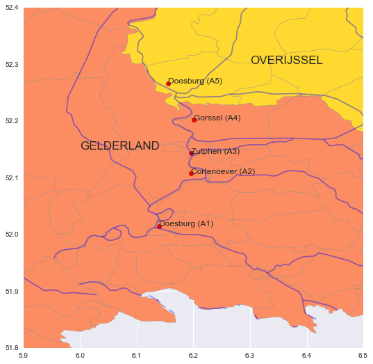
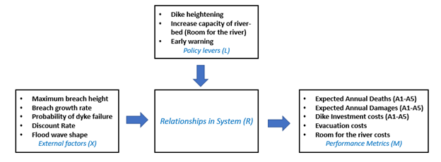

The Netherlands has a history of major flood events. After the 1953 North Sea Flood, the Dutch government began implementing sophisticated flood management systems throughout the country and promised “Never Again” to its citizens. For policymakers today, combating the threat of flood events remains high on the political agenda, though it is complicated by the presence of multiple (sometimes conflicting) objectives and pressure caused by climate change. Inevitably, proposals for large-scale flood management measures involve trade-offs between risk and cost, and decisions must be made in the face of future uncertainty and emotional constituents. Decision-makers increasingly turn to advanced hydrological and simulation models to understand the positive and negative effects of proposed policy options.

# The province of Gelderland along the River IJssel
The following analysis concerns the River IJssel region of the Netherlands, where the province of Gelderland is considering policy proposals to reduce flood risk in their municipalities. Gelderland consists of a mix of strategically important rural and urban areas with four dike rings situated along the IJssel River. The province is responsible for finding a flood risk management strategy that is acceptable to constituents living in these dike rings as well as the national government who would ultimately help fund and build the project.

 

 

## Deep Uncertainty
The following analysis uses exploratory modeling techniques  to help Gelderland challenge the difficulties of making decisions in the face of the unknown. Hydrological systems like the River IJssel are subject to large-scale complexity and they can be characterized using the term “[Deep uncertainty](https://www.sciencedirect.com/science/article/pii/S1364815212003131)” where the decisions are made without consensus on the probability distributions of possible events or how future consequences should be included. Multiple actors, each with their own set of values, interests and objectives, are involved creating policies for managing the risk along the IJssel which makes it difficult to reach a consensus on shared values and knowledge

In this analysis, strategies for managing flood risk along a segment of the IJssel River are provided to the province of Gelderland. Decision-makers in Gelderland are responsible for creating a policy proposal which takes into account the internal preferences of its four municipalities situated along the river, as well as external dynamics relative to neighboring provinces and national authorities. The purpose of the analysis is to help Gelderland identify robust strategies for reducing flood risk in the province, while keeping in mind the political dynamics that will inevitably affect the policy adoption process.

 

 

# Decision Support on River IJssel Flood Management
The [River IJssel Flood Management case](https://www.mdpi.com/2076-3263/8/6/224/htm) is an example study of the conflicts that frequently arise between scientists and policymakers, especially for deeply uncertain problems. The following features are notable:
* There are a variety of plausible models of the flood system
* There is no single "correct" way to frame the problem. A combination of perspectives and scenarios is needed.
* Exploratory modeling approaches can help decisionmakers to explore and adapt. The goal is to **identify differences that make a difference**. Then, help policymakers to design plans that are relatively insensitive to these differences (i.e. exogenous uncertainties).

Through the use of advanced exploratory modelling techniques, this analysis performs exhaustive computations to take into account the multiple (conflicting) objectives that the province faces. The overall goal is to support Gelderland to make an informed policy decision regarding River IJssel investment. Using advanced simulation techniques which take into account the conflicting objectives faced by Gelderland as well as the uncertainties about how future events will unfold, the following analysis aims to give the client a robust set of strategies to enable informed decision-making. Such techniques are sophisticated, but an even greater challenge may lie in interpreting and communicating the overwhelming number of simulation results obtained. Therefore, in order to translate the implications from the multi-objective outcome space, a [Decision Support Dashboard](https://plot.ly/~SMGross/32/dike-increases-under-the-super-safe-policy-rfr-under-the-super-safe-policy-ews-u/ ) has been created for the client.

## Example exploratory model for the River IJssel case study
View the full code here: [Decision Support on River IJssel Flood Management](https://github.com/shannongross/Model-Based-Decision-Making)

 
## References
Lempert, R. J., & Groves, D. G. (2010). Identifying and evaluating robust adaptive policy responses to climate change for water management agencies in the American west. Technological Forecasting and Social Change, 77(6), 960-974.

Kwakkel, J. H., Walker, W. E., & Haasnoot, M. (2016). Coping with the wickedness of public policy problems: approaches for decision making under deep uncertainty.
