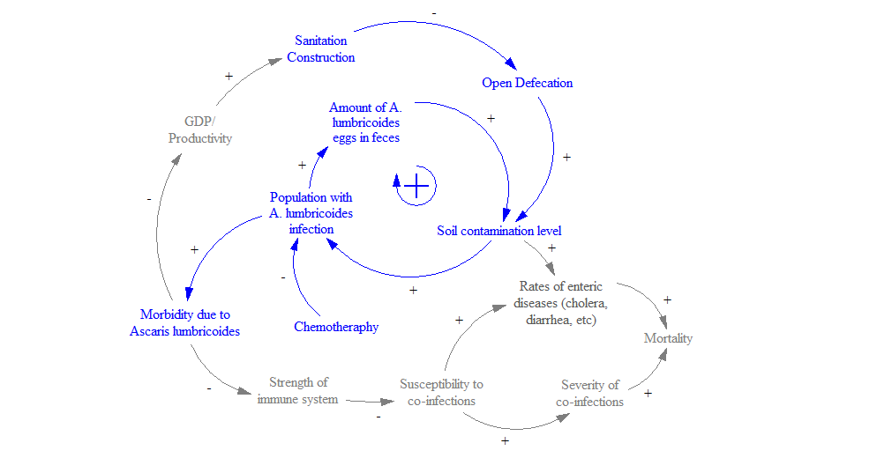
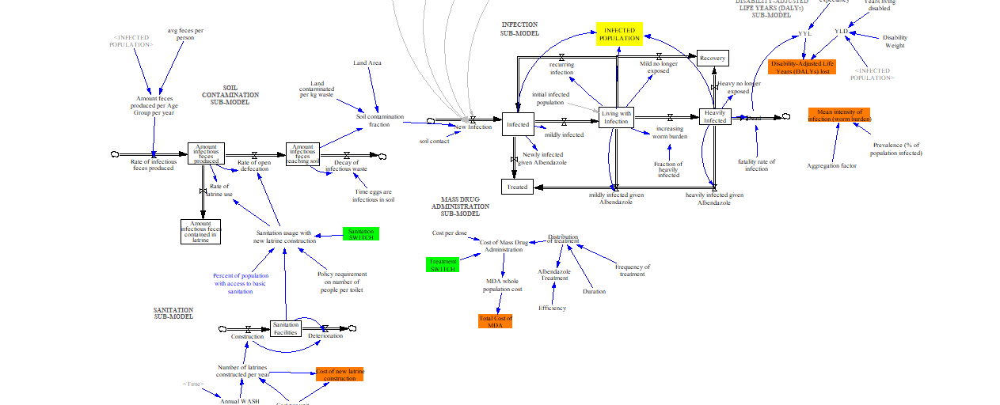
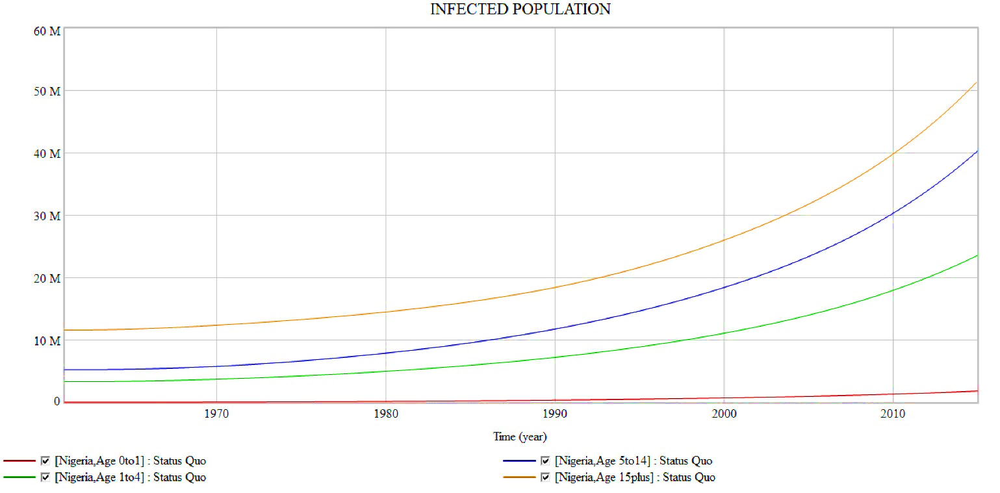
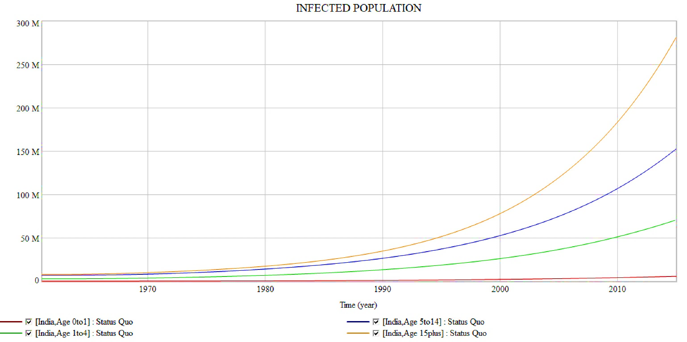
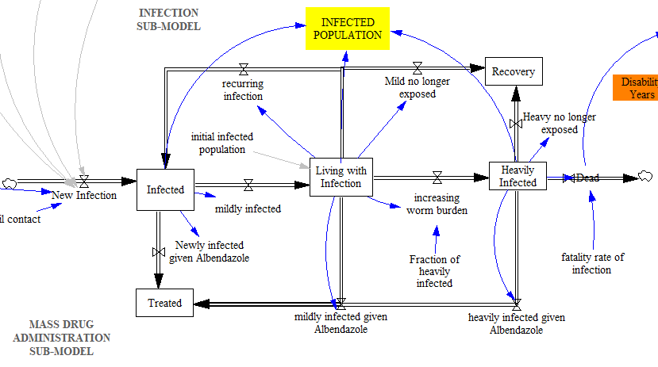
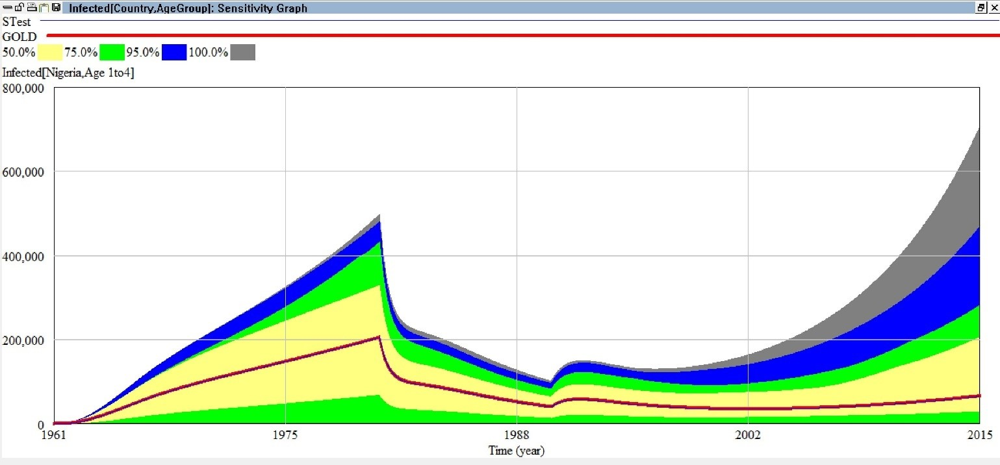
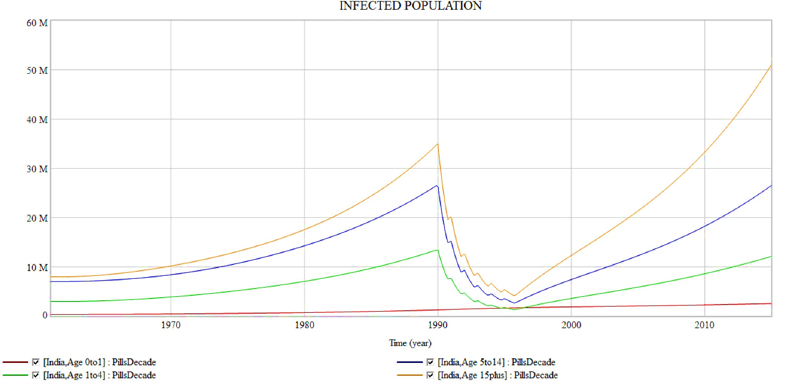

- TOC
{:toc}

# Problem description
It is estimated that up to 24% of the global population is infected by the parasitic worm *Ascaris lumbricoides*. Take a moment to let that sink in - that's nearly **one in four human beings** on planet earth today.

The mind-boggling prevalence of many Neglected Tropical Diseases has to do with the unhygenic conditions of poverty. People who live in areas with poor sanitation and hygiene conditions are at the highest risk of acquiring *A. lumbricoides* infection. *A. lumbricoides* leads to anemia, stunting, cognitive defects, and malnutrition. However, because infection does not generally lead to mortality, it is widely overlooked by policymakers and academics alike.

Global development organizations and public health agencies have struggled to alleviate the burden of *A. lumbricoides* in low-income areas. Intervention attempts are complicated by the nature of the parasite and because of:
- the difficulty of providing sanitation coverage
- high rates of reinfection after de-worming programs

Intervention strategies against the parasite typically focus on improving water, sanitation, and hygiene (WASH) conditions or on delivering albendazole through a Mass Drug Administration (MDA) program. In order to reduce *A. lumbricoides* prevalence, MDA programs must be designed carefully. Many intervention strategies have only targeted kids (SAC and PreSAC) because they are hit hardest, and generally the programs are only funded for about 4-6 years.

## Goal of this modeling
* Find strategies to break the cycle of *A. lumbricoides* transmission in Nigeria and India, whether through sanitation or mass drug administration.
* Compare sanitation and mass drug administration policies in terms of: cost, DALY reduction, and “bounce back” over time.

## Conceptual model
 

 
The main feedback loop in this model highlights the significance of having an infectious soil reservoir, which contributes to disease transmission unless interrupted (shown in blue below). Expanded versions of this model should incorporate feedback effects of GDP and improved sanitation (shown in grey).

## Key Performance Indicators
* **Disability-Adjusted Life Years (DALYs)**: Successful interventions should see a significant decline in DALYs.
* **Infected Population**: Turning on the “Treatment SWITCH” for different age groups will sharply reduce the number of infected. Altering “Frequency” and “Duration” of treatment changes the outcome of the Mass Drug Administration program. Alternatively, turning on the “Sanitation SWITCH” adds a hypothetical number of “newly constructed toilets,” which also reduces the number of affected persons.
* **Cost**: Comparing the costs of mass drug administration (“Total cost of MDA”) to the cost of constructing new sanitation facilities (“Annual WASH construction budget”), facilitates program design and budget allocation.
* **Mean Worm Burden**: The average intensity of infection per AgeGroup. For example, a Pre-SAC worm burden of “10” means that the average infected pre-school aged child in that country hosts 10 adult worms. Due to higher soil contact rates, Pre-SAC and SAC populations generally have the highest-intensity infections.

 

## Critical assumptions
* No data are available on the number of sanitation facilities in India or Nigeria for the years 1960-1990. For this time period, sanitation access was estimated.  
* We assume that the population can recover naturally only when sanitation access is greater than 50%. Otherwise, the population is constantly re-infected via exposure to contaminated soil.
* Soil contact rates of each AgeGroup were approximated based on literature estimates. More precise estimations would need to consider lifestyle, hygiene, education, diet, and many other factors.
* Model assumes that feces infect a constant amount of soil; in reality, this would not be heterogeneous.

## Special structures or functions
Flow loops occur inside the Infection sub-model because Nigeria is endemic for Ascaris lumbricoides, thus people are either continually infected (accumulating worms) OR are treated with Albendazole but then immediately get re-infected (typically within 1 year). Only by treating the population with Albendazole indefinitely or increasing sanitation access above 50% can the feedback effects be interrupted.

## Base case behavior
Fig 1a. Nigeria Status Quo (No intervention)
{:.post-img-large}
 
Fig 1b. India Status Quo (No intervention)
{:.post-img-large}

## Explanation of Infection Sub-model
In areas that are endemic for a. lumbricoides, most people are essentially “living with a mild infection” because they are constantly being re-infected and/or accumulating parasites. Therefore, the bulk of the infected population is contained in this “recurring infection” loop.

A very small portion of the population become “heavily infected” and may die if not treated. Currently, this sub-model assumes a constant fatality rate (which is higher in children). However, in future models we would like to tie the fatality rate to the mean worm burden, since fatality is related to the intensity of the infection.

 

 

The lifespan of an adult parasite in a host is 1-2 years. Therefore, if a person is moved out of an infectious environment they will pass the worm from their body in that amount of time. However, in endemic areas the soil is so infected that a person will probably acquire a new parasite in that amount of time, rather than be able to recover naturally. Therefore, we assume that unless sanitation access is >50%, the population will be stuck in the “recurring infection” loop. If new latrines are constructed such that the majority of them have sanitation access, then people are able to more to the “Recovered” stock.

If the treatment switch is turned on (for any of the AgeGroups) then the infected members of those AgeGroups will move to the “Treated” stock.

# Sensitivity Analysis
#### How sensitive is the number of infections to “soil contact rate?”
The variable “soil contact rate” was an educated estimate. This is a highly understudied academic domain with very few studies that have taken measurements taken to gauge soil contact. Doing so would be extremely time and resource intensive, because researchers would essentially need to understand how much “new” dirt individuals come into contact with each day, from activities ranging from eating an unwashed vegetable to petting a dusty animal. Some epidemiological studies estimate contact rates of 0.02, which was the basis for our soil contact estimates. We assumed low values for infants -who are likely to be held on the hip by the mother- and also low for adults who are cleaner. Higher values used for children to reflect high infection rates.

 

{:.post-img-large}
Note: figure shows sensitivity for Nigerian Pre-School Aged Children only for readability.

 

## Recommendations & Conclusions:
* Mass Drug Administration is a cost-effective strategy to reduce A. lumbricoides transmission; however, it must be designed carefully. Many intervention strategies have only targeted kids (SAC and PreSAC) because they are hit hardest, and generally the programs are only for a few years. A robust program should consider running for a longer duration and adding adults to the treatment program in order to reduce soil reservoirs.

Current treatment policy, India: Entire population treated, 1x per year for 6 years. N.B. Even when adults are included in the MDA program, “bounce back” will occur within a decade.

 

{:.post-img-large}

 

* Constructing sanitation facilities requires more upfront cost. However, improving sanitation infrastructure accomplishes 3 things:
  * Avoids having to treat the population indefinitely with Albendazole.
  * Decreases morbidity associated with A. lumbricoides infections. Doing so also increases immune function- significantly decreasing susceptibility to acquiring other diseases as well as the likelihood of dying from such diseases if acquired.
  * Decreases the prevalence of other sanitation-related infectious diseases (cholera, typhoid, etc).  

 

# References:
[View the full model here](https://github.com/shannongross/code_support/tree/master/vensim_population_model)
(Note: Requires [Vensim](https://vensim.com/vensim-software/) to run).
