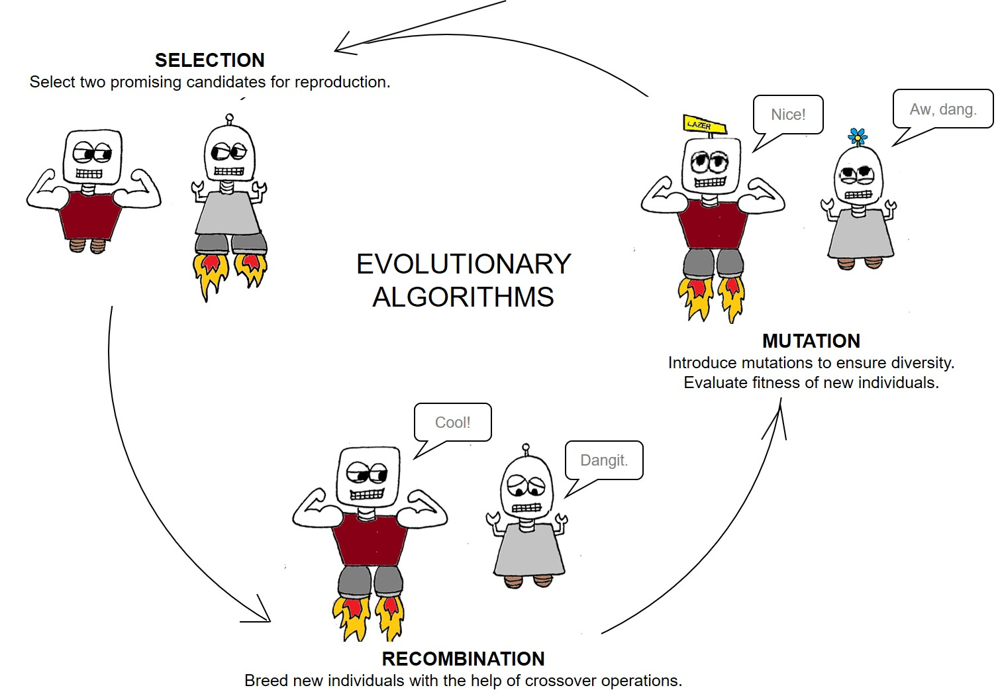

 
If you've worked on a large-scale, challenging issue before, then you know that one of the reasons the problem was so tricky is because any strategy idea that performed well in one area (e.g. increasing product quality) had the unfortunate effect of harming another area (e.g. increasing production cost). In the real world, decisions are made up of multiple objectives that often conflict with each other. This is where the notion of **many-objective optimization (MOO)** comes in, which attempts to find satisfactory solutions in light of conflicting objectives.

# Many Objective Optimization
There are many different ways to computationally search for promising candidate policies in light of conflicting objectives. The notion of **Pareto optimality** means finding a set of multiple best solutions for the problem, where each solution is a compromise between different objectives. A clear estimate of the Pareto front can be highly useful in helping policymakers to select robust plans as well as to learn about the underlying dynamics of the system. Since the presence of multiple, conflicting objectives means that the analyst cannot present a single "best" solution to the decision-maker, highlighting the pareto front can highlight important tradeoffs in the objective space.

The mathematics behind MOO can be complex, so a variety of new and increasingly innovative algorithms have been developed to handle the computations. Some of the most promising computational strategies in recent years are a part of the family of **evolutionary algorithms**, which mimic the processes of Darwinian evolution in order to find high-performing solution sets.  

 

 

By mimicking biological processes, genetic algorithms provide an efficient method for converging towards diverse and high-performing solution sets. For a deeper introduction into evolutionary algorithms, I recommend starting with [this video](https://youtu.be/1i8muvzZkPw).

# Why use Many-Objective Evolutionary Algorithms for robust policy search?
Many-Objective Evolutionary Algorithms (MOEAs) are particularly useful in their ability to perform global optimization and discover high-performing policy options. Mimicking natural processes of evolution, MOEAs iteratively evaluate possible strategies across the many objectives until the best candidates are found. Using an MOEA is chosen over classical optimization methods for the following reasons:
* Rather than handling a single solution, the population-based approach of MOEAs can be used to find a large number of solutions in a single run.
* MOEAs are ideally suited to working in parallel systems, which can dramatically reduce computational expenses.
* Because the algorithm’s evolutionary processes are separate from the issue it is applied to, MOEAs are easily applied to different problems.
The application of MOEAs to many-objective policy problems is useful for keeping performance measure disaggregated while enabling the evaluation of [trade-offs between various alternatives](https://www.sciencedirect.com/science/article/pii/S1364815212003131). In short, MOEAs provide an efficient way to determine the Pareto front and highlight potentially robust policy options.

 

 

# Which MOEA to use?
One popular algorithm for policy search is the **Nondominated Sorting Genetic Algorithm II (NSGAII)**, which was introduced by Deb in 2002. In many applications, NSGAII has been found to converge better than alternative algorithms and is capable of preserving a good level of diversity, thus avoiding getting stuck in a local minimum. The algorithm excels at obtaining a variety of solutions. NSGA-II uses an elitist strategy that allows it to find a better spread in the non-dominated front than other algorithms and get better solutions with less computational complexity. NSGAII is based on a non-dominated sort of the population in each iteration.

* The algorithm begins by generating a random population of policy levers.
* Then, the values of the objective functions are evaluated and ranked. The ranking represents how close that policy option is to the current Pareto front (rank of 1=on the front).
* Candidates are sorted based on their ranking (and then by **crowding distance**, which represents how far that solution is to other solutions in the same rank).

Traditional NSGAII was extended in 2005 by Kollat & Reed into **epsilon-NSGAII**, which includes adaptive population-sizing and epsilon-dominance archiving for increased performance. Many other MOEAs exist (such as BORG by Hadka and Reed) that present powerful search alternatives for policy analysis. Tools such as the [exploratory modeling workbench](https://github.com/quaquel/EMAworkbench) by Jan Kwakkel can incorporate a variety of search algorithms. Notably, epsilon-NSGAII is the default search algorithm used by ema workbench, which provides a relatively thorough and efficient use for beginner to intermediate applications.  

<!--  -->

 

## References
Kasprzyk, J. R., Nataraj, S., Reed, P. M., & Lempert, R. J. (2013). Many objective robust decision making for complex environmental systems undergoing change. Environmental Modelling & Software, 42, 55-71.

Kollat, J. B., & Reed, P. M. (2005, March). The value of online adaptive search: a performance comparison of NSGAII, ε-NSGAII and εMOEA. In International Conference on Evolutionary Multi-Criterion Optimization (pp. 386-398). Springer, Berlin, Heidelberg.
