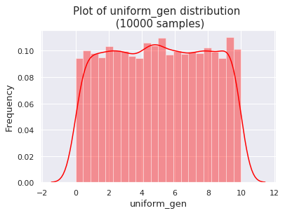
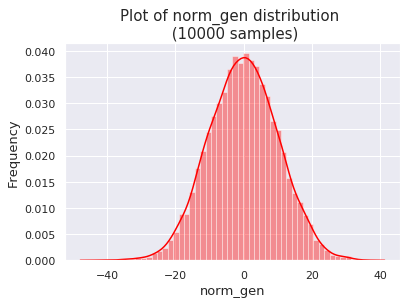
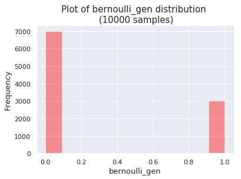
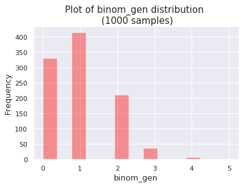
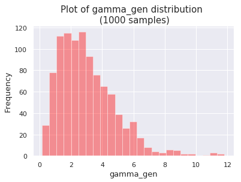
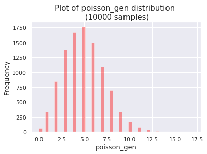

The following article will cover common probability distributions, including: Uniform, Normal, Bernoulli, Binomial, Poisson and Gamma. I'll discuss the strengths and weaknesses of each distribution, as well as their key assumptions. I'll also use a Python function to show how each one can be plotted using the Seaborn library.

1. TOC
{:toc}
{:.toc-styling}

## Probability Distributions
Probability theory is all about using mathematics to study uncertainty (or "stochasticity"). Probabilities help us to express the inherent stochasticity in our surroundings. A major part of making sense of this stochasticity involves the study of **randomness**, which is central to probability theory. More formally, a probability distribution **p(x)** indicates the likelihood that the random variables takes a particular value of **x**.

If I ask you think of a random number, there are an infinite number of different values you might give me. But when applying the term "random" to solving real-world problems, our experience gives us an intuition that some values are more likely to occur than others. For instance, if you go to the pharmacy right now to pick up a prescription, we might not know the exact amount of time you'll end up having to wait in line. Instead, we could simulate this using a random value drawn from a probability distribution. This function makes use of our knowledge of past events to help us narrow down the range of an uncertain value. Based on previous experiences at that pharmacy, you know that you typically wait in line eleven minutes, you've never gotten out in less than five minutes, and one particularly bad day you had to wait eighteen minutes. Under no circumstance would you expect to wait 300 minutes, for example. Probability distributions employ this information to gain a better understanding of what value the uncertain parameter is likely to take.

Before going any further, we should make a distinction between the two main classes of probability distributions.

## Two classes of probability distributions
1. **Discrete probability distributions**.
Also known as *probability mass functions*, this distribution class is used for variables that can assume a discrete number of values. Discrete numbers are finite and "whole" in the sense that they do not accept in-between values. For instance, if you are counting the number of patients a doctor sees per hour, that is a discrete value because she might see 11 or 12 patients, but nothing in between. With this type of distribution, each potential carries a particular probability value of it occurring (the sum of all probabilities must add up to 1). The Poisson and Binary distributions are examples of popular discrete distributions that often appear.

2. **Continuous probability functions**.
Unlike discrete variables, continuous parameters have an infinite outcome space. With continuous data, a probability indicates the likelihood that a value will fall within a range. Continuous distributions can be represented with a *probability density function*, which is an integrable function with a sum of the area under its curve equal to 1. Most continuous probability distributions have between 1-3 parameters that represent essential properties and ultimately define its shape

The distinctions between different types of probability distributions are easily seen when plotted. We can use the python scientific computing library [SciPy](https://www.scipy.org/) to help us with this.


# Import SciPy distributions
from scipy.stats import uniform, norm, bernoulli, poisson, gamma, binom

# Import plotting libraries
import seaborn as sns

# Set options
sns.set(rc={'figure.figsize':(6.5, 6)})
sns.set_style({'font.family': ['DejaVu Sans']})


## SciPy - a python package for scientific computing
SciPy is a useful python library containing a `SciPy.stats` feature that makes it easy for drawing from random probability distributions. You can get a list of all the statistical functions that SciPy contains by typing `??stats`. In SciPy, the following arguments are most important for describing function shape:
- The keyword `loc` stands for "location" and specifies the mean.
- The keyword `scale` keyword specifies the standard deviation.
- Binary distributions are specified using a keyword `p`, which denotes the probability of success.

In the following block of code, I define a function to easily plot multiple common probability distributions. If you would like to see how to plot each one individually, I recommend working through [this tutorial](http://cmdlinetips.com/2018/03/probability-distributions-in-python/).


#Define a function to generate probability distribution
def plot_distribution(distribution, num=1000, mean=0, sd=1, \**kwargs):

    """
    name: name of distribution
    num: number of samples to generate
    mean: loc
    sd: scale aka standard deviation
    kwargs:
        p: for specifying bernoulli and binomial (should be between 0-1)
        n: for specifying binom
        mu: for specifying poisson
        a: for specifying gamma
    """
    p = kwargs.get('p', None)
    n = kwargs.get('n', None)
    mu = kwargs.get('mu', None)
    a = kwargs.get('a', None)

    dist_name = (type(distribution).__name__)
    if dist_name == 'uniform_gen':
        data = distribution.rvs(size=num, loc = mean, scale=sd)

    elif dist_name == 'norm_gen':
        data = distribution.rvs(size=num, loc = mean, scale=sd)

    elif dist_name == 'bernoulli_gen':
        data = distribution.rvs(size=num, p=p)

    elif dist_name =='binom_gen':
        data = distribution.rvs(n=n,p=p,size=num)
        """
        Arguments for binomial distribution:
            p: probability of success
            n: number of independent experiments per trial
            size: number of trials
        """
    elif dist_name =='poisson_gen':
        data = distribution.rvs(mu, size=num)

    elif dist_name =='gamma_gen':
        data = distribution.rvs(a, size=num)

    else:
        print("Sorry, I don\'t recognize that distribution.'")

    ax = sns.distplot(data,
                  # kde=False,
                  color='red')

    ax.set_xlabel(dist_name, fontsize=13)
    ax.set_ylabel('Frequency', fontsize=13)
    ax.set_title(label= 'Plot of ' + dist_name+ ' distribution \n (' + str(num) + ' samples)', fontsize=15)


# Common probability distributions

### Uniform
In a uniform probability distribution, variables are evenly distributed over a given range. Thus, all possible outcomes have an equal chance (likelihood) of occurring. This distribution is useful for modeling multiple events that occur with the same probability. This distribution, which can be discrete or continuous, is also referred to as the *rectangular distribution* because of its shape. Examples of a uniform distribution include:
* The number of patients seen by a physician in one hour are uniformly distributed between 10 and 20.
* The last digit of the social security number of your postman is uniform because has an equal chance of being any number 0-9.
* The day of the week that the rainiest day of the year occurs on is uniform because it is equally likely to be any of the seven days of the week.
* The chance of winning a lottery where everyone buys one ticket is uniform because each person is just as likely as the others to win.


plot_distribution(uniform, num=10000, mean=0, sd=10)


### Gaussian
The Gaussian (Normal) distribution is the most famous continuous distribution - it's nice, familiar, and makes us happy to draw it. Just give the mean and standard deviation to create this bell-shaped curve. Because its only characterized by two parameters (the mean and variance) it's very easy to create. Real-world examples of the Gaussian distribution occur in:
* Grades, such as SAT scores, tend to fall around a C average, with less students scoring a B or D, and even less students scoring an A or F.
* How much money people make in an economy tends to fall around an average value with some variance for the very poor/wealthy.
* Anthropometric data from a sample population, such as height, shoe size, and blood pressure samples usually form a bell-shaped curve.


plot_distribution(norm, num=10000, mean=0, sd=10)


### Bernoulli
A Bernoulli trial is one of the most basic distributions, since the random variable can take on one of two values. When a random trial can only end in one of two outcomes (success or failure), it may be referred to as a **Bernoulli Trial**. Examples include:
  - Will it snow tomorrow? (Yes/No)
  - Will the Penguins win against the Capitals tonight? (Win/Lose)
  - Will she accept my proposal? (Success/Fail)

This type of distribution is specified by a single parameter (p), which indicates if the trial was a success or failure. The likelihood of success and failure don't have to be the same. We differentiate between the Probability of success (p) and the Probability of failure (1 - p).


plot_distribution(bernoulli, num=10000, p=0.3)


### Binomial
The Binomial distribution is used to model binary data (when only one of two possible outcomes can occur). It is applied to finding the probability that an event happens a certain number of times in a fixed number of trials. However, in order for a binomial distribution to be a good fit for the data, the following four assumptions must be met:

**Binomial Assumptions**
1. The experiment can have only one of two possible outcomes (yes/no, live/die, heads/tails)
2. Each trial is independent of the others. The outcome of one trial does not influence another trial.
3. The given probabilities remain constant. For some processes, they may change over time.
4. There is a set total number of trials.

Keep in mind that the binomial distribution models the frequency of an outcome over a set number of trials. If you need to model something else, don't use this distribution. Examples of Binomial distributions include:
- Tossing a fair coin.
- Getting the flu or not getting the flu.


plot_distribution(binom, n=5, p=0.2)


### Gamma
The Gamma distribution models the amount of waiting time between Poisson distributed events. This type of distribution is useful when you're working with *rates*, for instance the amount of waiting time in a line.  Many natural events happen randomly yet still have well-established averages. For instance, when a specific person will die is unknown, though the country's average life expectancy is known. Other examples of when the gamma distribution applies include:
- Hunting. Suppose it is deer season and you expect to shoot a deer in one week. Calculate the probability that you'll have to wait between 3 and 5 weeks before you shoot a deer.
- The flow of manufacturing products across an assembly line.
- Pageviews on a website.
- The size of student loan defaults. A bank may know how often loan defaults occur on average though the particular occurrences are random.


plot_distribution(gamma, a=3)


### Poisson
The Poisson distribution excels at working with *count* data. In other words, you can easily make a table containing the counts (1, 2, 3, etc.) along with the likelihood of each count. Often, this is used to determine the probability that a certain number of events will happen during a fixed time frame. The Poisson distribution is highly useful when you're working with the arrival of events because describes the probability of n events occurring during a set period of time. Therefore, a key parameter is the *average arrival rate (mu)*, which is important for determining the shape of the function.

**Poisson Examples**
- The number of patients a doctor sees per hour.
- The number of food items donated at a shelter each day.


plot_distribution(poisson, num=10000, mu=5)


### Probability Distributions - Conclusion
How should uncertainty be handled when a system has some kind of randomness? Having a function that describes the dispersion of the values that a random variable can take is useful for many real-world problems. While the values of the unknown parameter still vary based on the underlying probability distribution, the function helps to reduce the uncertainty band around some output to its "typical" value.

**Caution**: Using a standard probability model may not work for all types of uncertainty, especially [deep uncertainty](/exploratory-modeling-public-health/).

<!-- # References
https://statisticsbyjim.com/basics/normal-distribution/ -->
