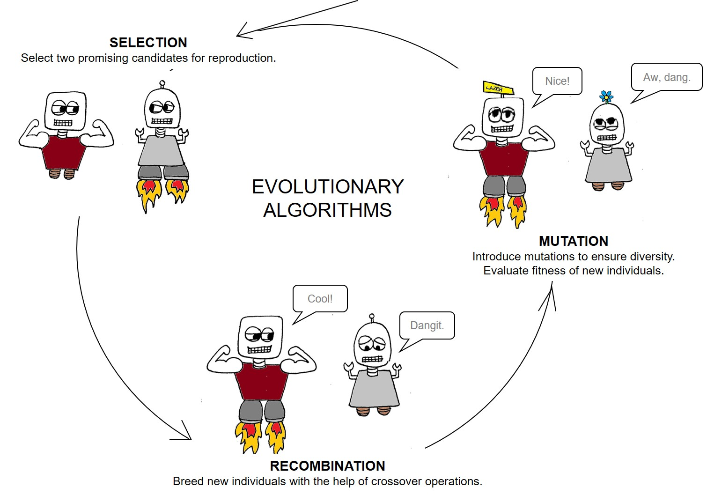
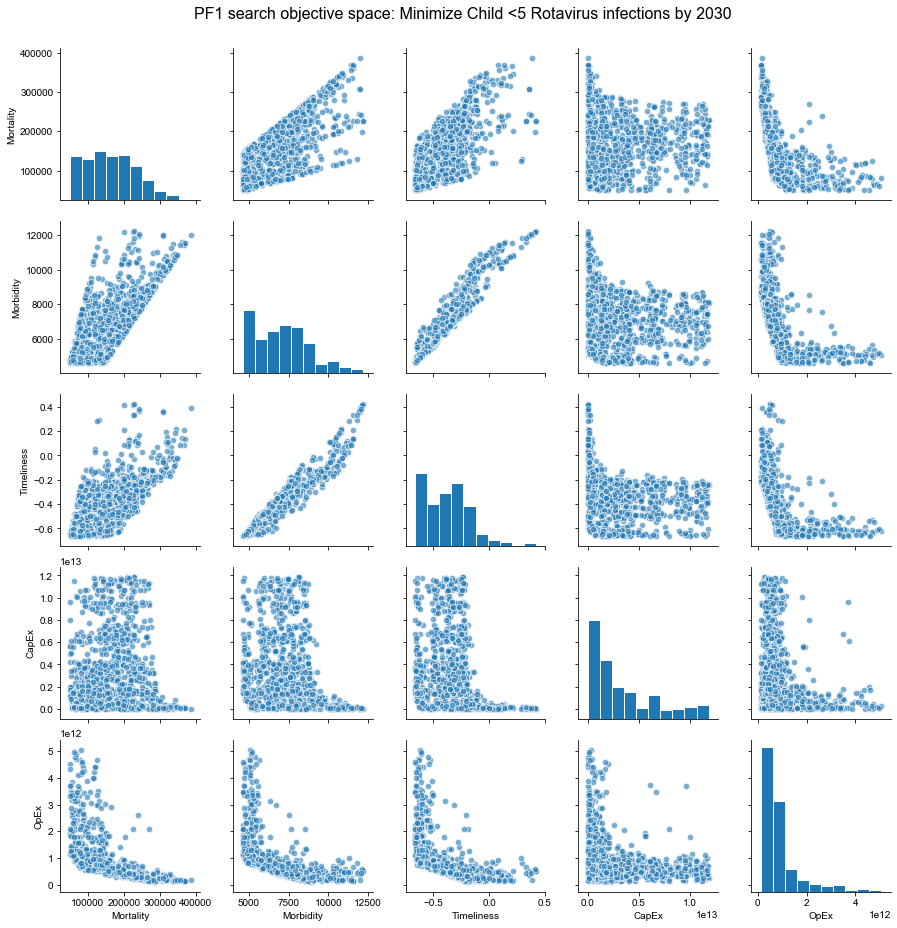

Think of a decision you struggled with recently. Whatever the decision was, perhaps one of the reasons you struggled with it was because it contained more than one objective.

For instance, it wasn't simply about getting accepted into the best university; but about getting into a university that had the right major for you, *and* that you could afford, *and* that wasn't too far from home, *and* that had the right extra-curricular programs. The trouble is that every time you find a university that does really well for some of these criteria (e.g. excellent school, great major), it seems to fare less well on other criteria (e.g. really expensive, really far from home). Some of the most challenging decisions we face occur when our objectives are conflicting so we inevitably have to compromise something, although we're not sure what should be compromised or to what extent.

In the policy realm, policymakers often have to face large-scale problems with more than one objective, also known as **multiobjective problems (MOPs)**. Some examples are:

- Trying to develop a health care strategy that ensures: high coverage, high quality of service, at the lowest cost.
- Wanting to deliver high-speed internet access, balancing between targeting the highest concentration of people (e.g. cities) and being equitable (not neglecting rural citizens).
- Developing a community water supply system that: maximizes water availability and quality, minimizes city and consumer costs over time, and contributes the least amount of environmental disruption.

For each of these examples, it's unlikely that policymakers will be able to come up with one strategy that perfectly achieves *all* of their goals. Instead, they'll likely have to compromise on one or more objectives. In the real world, decisions are made up of multiple objectives that often conflict with each other. This is where the notion of *many-objective optimization (MOO)* comes in, which attempts to find satisfactory solutions in light of conflicting objectives.

**Article Contents**
- TOC
{:toc}

 

## Many Objective Optimization
A multiobjective problem will rarely (likely never) result in a single, “best” solution. Instead, there will likely be a suite of solutions where the objectives are optimized differently. An important concept is that of **Pareto optimality**, which is used to compare the solutions of a MOP. Pareto optimality is concerned with finding a *set* of best solutions for the problem, where each solution is a compromise among objectives. Ultimately, no computer can make the final policy choice out of the pareto-approximate set, since this last part of the process is more a question of values and principles rather than numbers.

The aim of MOO is to find the approximate Pareto Front, which represents the area of the objective space where no additional improvement in any single objective can be achieved without decreasing the performance of another objective. Having a clear estimate of the Pareto front can be highly useful in helping policymakers to select robust plans as well as to learn about the underlying dynamics of the system.

The mathematics behind MOO can be complex, so a variety of new and increasingly innovative algorithms have been developed to handle the computations. Some of the most promising computational strategies in recent years are a part of the family of **evolutionary algorithms**, which mimic the processes of Darwinian evolution in order to find high-performing solution sets. Evolutionary Algorithms are highly promising for helping to solve MOPs because they are population-based search (optimization) methods that don’t rely on assumptions like differentiability.

By mimicking biological processes, genetic algorithms provide an efficient method for converging towards diverse and high-performing solution sets. For a deeper introduction into evolutionary algorithms, I recommend starting with [this video](https://youtu.be/1i8muvzZkPw).

 

 

# Why use Many-Objective Evolutionary Algorithms for robust policy search?
Many-Objective Evolutionary Algorithms (MOEAs) are particularly useful in their ability to perform global optimization and discover high-performing policy options. Mimicking natural processes of evolution, MOEAs iteratively evaluate possible strategies across the many objectives until the best candidates are found. Using an MOEA is chosen over classical optimization methods for the following reasons:
* Rather than handling a single solution, the population-based approach of MOEAs can be used to find a large number of solutions in a single run.
* MOEAs are ideally suited to working in parallel systems, which can dramatically reduce computational expenses.
* Because the algorithm’s evolutionary processes are separate from the issue it is applied to, MOEAs are easily applied to different problems.
The application of MOEAs to many-objective policy problems is useful for keeping performance measure disaggregated while enabling the evaluation of [trade-offs between various alternatives](https://www.sciencedirect.com/science/article/pii/S1364815212003131). In short, MOEAs provide an efficient way to determine the Pareto front and highlight potentially robust policy options.

## Which MOEA to use?
One popular algorithm for policy search is the **Nondominated Sorting Genetic Algorithm II (NSGAII)**, which was introduced by Deb in 2002. In many applications, NSGAII has been found to converge better than alternative algorithms and is capable of preserving a good level of diversity, thus avoiding getting stuck in a local minimum. The algorithm excels at obtaining a variety of solutions. NSGA-II uses an elitist strategy that allows it to find a better spread in the non-dominated front than other algorithms and get better solutions with less computational complexity. NSGAII is based on a non-dominated sort of the population in each iteration.

* The algorithm begins by generating a random population of policy levers.
* Then, the values of the objective functions are evaluated and ranked. The ranking represents how close that policy option is to the current Pareto front (rank of 1=on the front).
* Candidates are sorted based on their ranking (and then by **crowding distance**, which represents how far that solution is to other solutions in the same rank).

Traditional NSGAII was extended in 2005 by Kollat & Reed into **epsilon-NSGAII**, which includes adaptive population-sizing and epsilon-dominance archiving for increased performance. Many other MOEAs exist (such as BORG by Hadka and Reed) that present powerful search alternatives for policy analysis. Tools such as the [exploratory modeling workbench](https://github.com/quaquel/EMAworkbench) by Jan Kwakkel can incorporate a variety of search algorithms. Notably, epsilon-NSGAII is the default search algorithm used by ema workbench, which provides a relatively thorough and efficient use for beginner to intermediate applications.  

<!--  
{:.post-img-large}
  -->

<!--  -->

## Concluding Remarks
The popularity of applying many objective evolutionary algorithms to complex real-world issues has risen dramatically over the last several years. The ability of MOEAs to efficiently approximate a pareto front is useful for helping policymakers make sense of important tradeoffs in the objective space. This is especially the case when the presence of multiple, conflicting objectives means that the analyst cannot present a single "best" solution.

A challenge remaining in MOO research is the difficulty [visualizing the solutions](/ema-workbench-visual). Often, special methods, such as parallel (rather than orthogonal) coordinate plotting or dimensionality reduction are needed.

 
{:.post-img-smaller}

 

## References
Kasprzyk, J. R., Nataraj, S., Reed, P. M., & Lempert, R. J. (2013). Many objective robust decision making for complex environmental systems undergoing change. Environmental Modelling & Software, 42, 55-71.

Kollat, J. B., & Reed, P. M. (2005, March). The value of online adaptive search: a performance comparison of NSGAII, ε-NSGAII and εMOEA. In International Conference on Evolutionary Multi-Criterion Optimization (pp. 386-398). Springer, Berlin, Heidelberg.
