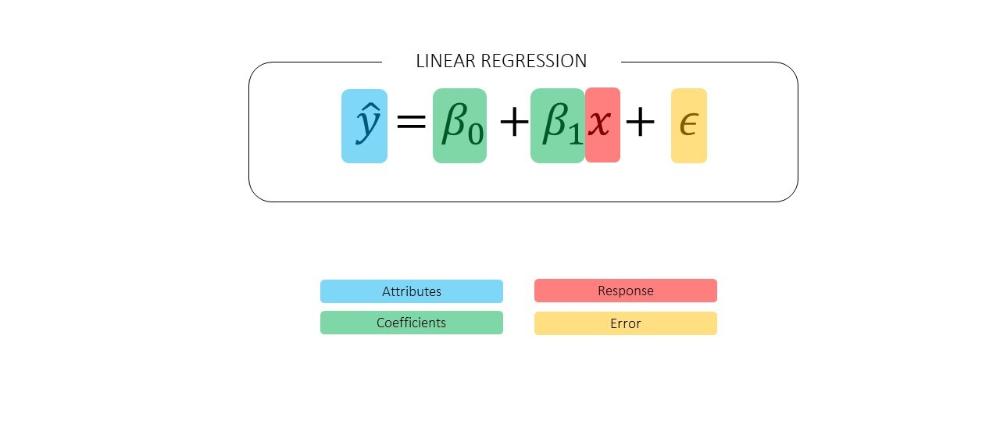
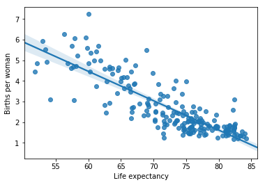
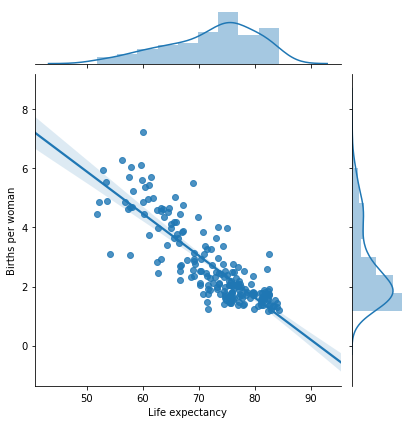
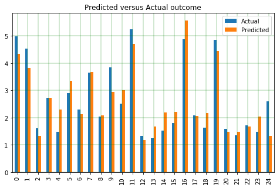
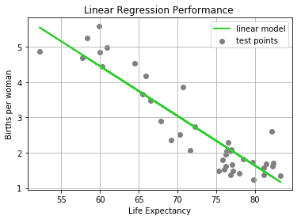

Linear regression is useful for evaluating the relationship between a dependent variable and a set of independent variables. A linear regression model produces a function in which each coefficient describes the relationship between a particular outcome of interest (e.g. mortality rate) and a set of explanatory variables (e.g. age, income, access to clean water). Once you have this equation, you can use it to make predictions about your data. For instance, how would a certain policy targeted at increasing access to clean water affect mortality rates? By changing the explanatory variables (e.g. increase clean water access), analysts can simulate a policy intervention and learn how it might affect the target variable of interest.

1. TOC
{:toc}
{:.toc-styling}

Linear Regression is commonly used when you have a set of input values and want to try to predict the output (response) of another variable of interest. The linear model is used to predict the outcome for cases we don't have data on, so it's an exciting technique. However, linear regression can't perfectly capture the relationship, so there is always an additive term that reflects all influences the model is not accounting for (called the "error term"). The aim is to try and determine a linear function that describes the control variable with the least amount of error. While regression can be used on categorical data, it is most often used by analysts to predict (continuous) values from a set of input data.

 

### General structure of linear regression:
- y : response variable
- X's: predictor variables
- β0: coefficient for the y-intercept of the model
- β1: coefficient for the slope of the model  
- ε: the error term aka how far our prediction using the x's varied from the actual Y value

 

 

Linear regression is particularly useful for problems where you think the variables could be entwined with one another, something that is *extremely common* in policy problems. For example, consider the following questions:
- Does economic status and ethnicity impact traffic stop behavior?
- Does walking long distances to get water and water quality relate to morbidity rates?
- Does education and economic background affect public health?

You can see how in these policy questions there might be some entanglement between the explanatory variables that would influence the outcome of interest. Regression works well at isolating the role of each independent variable.

### Case study - global life expectancy
<!-- Now I don't know about you, but I'm *SO TIRED* of looking at house pricing data. It seems like every big data tutorial has to do with real estate. (Andrew Ng's machine learning tutorials are great - but as a Millennial who will probably never buy a house the thought of studying 'square footage' by 'price' puts me to sleep every time). -->

Here, I'll use some data I compiled from the United Nations and World Bank to make an example where we predict a country's **Life Expectancy** from features such as "Births per woman" and "Percent of children <5 with anemia". We'll analyze these features using [sklearn](https://scikit-learn.org/) in python, which makes performing the regression much easier. There are five main steps to performing linear regression:
1. Prepare data/visualize it (make sure that a linear relationship exists!)
2. Categorize the data into attributes and labels
3. Split into 80% train and 20% test data
4. Fit model on the training data
5. See how well it performed

You can follow along with this example by downloading the data and full Jupyter notebook from [this repository](https://github.com/shannongross/code_support/tree/master/regression_tutorial).

 

# PART I: Single Variable Linear Regression
### Linear Regression Step 1: Prepare the data


#standard imports
import pandas as pd
import numpy as np
import seaborn as sns
import matplotlib.pyplot as plt
%matplotlib inline

#sklearn imports
from sklearn.linear_model import LinearRegression
from sklearn.model_selection import train_test_split
from sklearn import metrics


The next step is to gather the data set that we'll be using.


##Retrieve the full dataset
df_full = pd.read_csv('cleaned_datasets/NTD_data_per_country_cleaned.csv')

# Just get the subset we're interested in
dataframe2 = df1.dropna(subset=['Life expectancy','Births per woman'])


Now we have the data, but what does it look like? Use your standard pandas tools like `df.head()` and `df.describe()` to explore what the dataset contains.

For this example, we'll use the **Life Expectancy** and **Births per woman**. But before we begin trying to create a predictive model based on the data, we should confirm that a linear relationship actually exists between the two variables.


#Regression plot using seaborn library
sns.regplot(x='Life expectancy', y='Births per woman', data=df1)


 
{:.post-img-smallest}
 

Another option is to use a **join plot** to get a better feel for the distribution of points.


#Join plot in seaborn
sns.jointplot(x='Life expectancy', y='Births per woman', data=df1, kind="reg");


 
{:.post-img-smallest}
 

From the shape of these initial plotting exercises, we can be pretty sure that a linear relationship exists between our independent and dependent variables.

And now we're ready to begin with the actual regression.

### Linear Regression Step 2: Categorize into attributes and labels

| Attributes     | Labels     |
| :-------------: | :-------------: |
| These are our inputs      | This is the thing we're trying to predict      |
| Independent variable     | Dependent variable     |
| Also known as the input   | Also known as the target, output, or response   |
{: .post-table-med}

Fortunately for us, sklearn makes the Split-Train-Test process painless:

#get the x and y
X = dataframe2['Life expectancy'].values.reshape(-1,1)
y = dataframe2['Births per woman'].values.reshape(-1,1)


### Linear Regression Step 3: Slit into 80% train and 20% test
Next, we split 80% of the data to the training set while 20% of the data to test set using below code. Of course, this 80/20 split is actually quite arbitrary - its a good place to start when you're just learning but for more advanced analyses you'll want to consider different ratios for training and testing.


X_train, X_test, y_train, y_test = train_test_split(X, y, test_size=0.2, random_state=0)


### Linear Regression Step 4: Fit the model on the training data
Once the data has been separated into a 'training set' and a 'testing set', we can now use the training set to train the model. In sklearn, this is manner of creating a `LinearRegression()` instance in sklearn and fitting it to the training data.


#instantiate the model
regressor = LinearRegression()  
#training the algorithm
regressor.fit(X_train, y_train)


## Linear Regression Step 5: See how well it performed
Finally, we should observe the value of the slope and intercept calculated using the linear regression algorithm.


#To retrieve the intercept:
print(regressor.intercept_)
#For retrieving the slope:
print(regressor.coef_)


Check how good the model can predict new data, by inserting the 'X_test' data we set aside earlier.


# use test data
y_pred = regressor.predict(X_test)



# get a dataframe of actual versus predicted y values
df_output = pd.DataFrame({'Actual': y_test.flatten(), 'Predicted': y_pred.flatten()})
df_output.head()


It's probably nicer to compare these results visually instead of in table (dataframe) form, so we can make a bar chart to better see the difference between actual and predicted outcomes.


# Bar chart of actual vs predicted results
df_result = df_output.head(25)
df_result.plot(kind='bar',figsize=(8,5))
plt.grid(which='major', linestyle='-', linewidth='0.35', color='green')
plt.grid(which='minor', linestyle=':', linewidth='0.35', color='grey')
plt.title('Predicted versus Actual outcome')  
plt.show()


 
{:.post-img-smaller}
 

Alternatively, we might wish to look at these results using a scatter plot, so that we can overlay the linear model with the test data.


# test data versus linear regression model
plt.scatter(X_test, y_test,  color='gray', label='test points')
plt.plot(X_test, y_pred, color='limegreen', linewidth=2, label ='linear model')
plt.title('Linear Regression Performance ')  
plt.xlabel('Life Expectancy')  
plt.ylabel('Births per woman')  
plt.legend()
plt.grid(True)
plt.show()

 
{:.post-img-smaller}
 

Looking at these figures, it seems like our linear regression model is able to provide close (not perfect) approximations of the actual test data.  **Is the model a good enough fit?** At the very least, our model should be a better predictor than just using the mean value to estimate future trends. At this point, we may want to use some statistical metrics to evaluate the performance of our linear model.  

In order to minimize the overall error of a linear regression function, you try to minimize the error of each of the individual points (since the overall error is the aggregate of these). There are three popular metrics (MAE, MSE, RMSE) for evaluating how well the algorithm fit the data. The choice of which metric to use depends on the particular application and your objectives - often, using more than one metric is useful.

<h4>1. Mean Absolute Error (MAE)</h4>
Take the absolute value of how far off each residual was and average them. This gives you the **Mean Absolute Error (MAE)**, which is probably the easiest of the regression error metrics to understand. If you have a MAE of 0, then your model is a perfect predictor (unlikely).

We use the absolute value so that negative and positive values do not cancel out during the calculation. A disadvantage of this technique is that because all of the residuals are weighted equally when taking the average, we can't distinguish between a case where all the model predictions are of by a tiny bit versus a model where only some points are off by a large amount.

<h4>2. Mean Squared Error (MSE)</h4>
Mean Squared Error (MSE) is similar to MAE, except each residual is squared. Thus, MSE gives the variance of the error values (telling you how widely dispersed the errors are). By getting the square of the difference between predicted and actual, models with greater dispersion are penalized more.

<h4>3. Root Mean Squared Error(RMSE)</h4>
Like other metrics for assessing the performance of your linear regression model, RMSE measures how far the actual data points are from your regression line. What differentiates RMSE from MAE is that it is the **square root of the variance** of the residuals, which means that higher error values are penalized more. MAE weighs all the error the same, so a scenario where you have lots of data points off by a tiny bit could end up having the same MAE as a scenario where you have a just few data points off by a huge amount. Depending on your application, you may now want this (i.e. prefer to penalize the model with a few really large errors more) and so RMSE would be prefereable. By using RMSE, you can get an idea of how spread out your prediction errors are.

A useful characteristic of RMSE is that the result is in the **same units as the response variable**, unlike MSE which gives the result in response units squared.

Your overall goal is to **achieve the lowest value for RMSE** that you can. When the RMSE is sufficiently low, you can say that the model is useful for predicting the response.

## Linear Regression - Closing Remarks
Linear regression is one of the most commonly applied supervised machine learning techniques and can be a useful tool for policy analysts . However, analysts should be aware that if the outcomes of interest appears highly sensitive to the way the model is specified, then care should be taken to test alternative specifications and to perform statistical tests. There are no hard and fast rules for the "right" way to specify the linear model, so specification can be challenging.

Policymakers often want an answer to questions like: *"did policy x lead to outcome y?"* However, providing this kind of causal interpretation requires significant assumptions and can be difficult. Still, linear regression models often provide a quick starting point for more advanced analyses.

No matter the chosen method for data analysis, plotting the data you are trying to analyze is a critical part of the process. Scripting languages such as Python and especially R are useful for generating statistical plots (see: [Intro to R](/getting-started-with-R/)). As with all summary statistics, it is important to properly understand and apply the assumptions behind linear regression. See [Anscombe's quartet](https://medium.com/datadriveninvestor/anscombes-quartet-12649db7eac0) for a particularly infamous example of the improper application of Linear Regression. In an upcoming blog post, I'll dive deeper into this topic and explain some features of **multivariate** linear regression.
