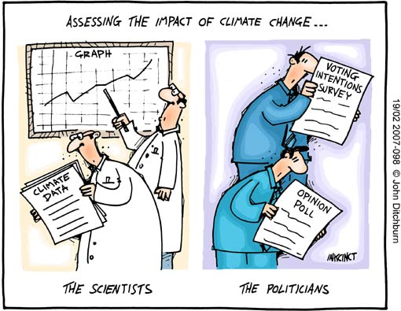

Innovative new tech opportunities such as machine learning, big data analysis, and cloud computing are already disrupting a wide variety of global issues. To be a part of the cool shift towards advanced computing though, you'll have to master a lot of old-school things like [classical statistics](/hypothesis-testing/) and [probability distributions](/probability-distributions/), which is why I've included several tutorials in this blog. But you'll find no examples of coin flips and dice-rolling here, because you can find that in plenty of other textbooks and websites. Instead, my focus is on the messy and uncertain situations that surround real-world policymakers. While the people who craft our environmental regulations, disaster budgets, and health insurance policies certainly rely on mathematical and statistical information, there is (hopefully) more to their decision making than measuring and coin-flipping.

**Article contents**
- TOC
{:toc}

 

# How do policymakers use scientific evidence?
The process of policymaking is probably never linear, although you'll find a number of decision analysis texts that seem to portray it as if it were. More likely, policies are made through interactions between multiple stakeholders (or "actors") and over a series of compromises, tangents, and revisions. Also, many policy ideas "sit on a shelf" until the right window of opportunity presents itself - perhaps through a shift in public opinion or financial opportunity - that makes the idea suddenly become favorable. Any multi-actor problem is bound to grapple with diverging interests, culture differences, miscommunication and differing information sources. And of course, the jaded among us will hark of corruption, partisanship, and hidden agendas. However, this is the nature of the world we live in and which really big and important decisions are made. To be useful, scientific analysis must be conducted in the world as it really is, not how we wish it was.

Those of us who are technically-inclined serve an important role in supporting those who are appointed to create large-scale policies. Whether you are:
- an engineer advising on the safety of a new infrastructure project;
- a data scientist making projections from census data;
- an epidemiologist giving input on how government money should be spent against a novel disease;
- an IT expert weighing in on a program to combat a cybersecurity threat;

All of these technocrats play a role in the ability of policymakers to make evidence-informed decisions. However, it is misleading to think of your role merely as the "neutral advisor". Data is assumed to be objective because we have institutionalized its use, however, we must understand that no analysis is truly "objective" and all data collection and modelling captures just part of the story.

The standard scientific model assumes that if there is not a consensus about some fact, then more research should be done and then the truth will be revealed. However, applying this standard model to problems in the policy sphere - where all facts seem up for debate - means that conducting *more* research is unlikely to resolve the problem. This is a major frustration to scientists, who may implicitly assume the following linear trajectory exists:

"more science"  &rarr; "less uncertainty"  &rarr; "correct course of action"  &rarr; "political action"

Therefore, to the scientifically-inclined, the only excuse for a lack of policy action can be if there is uncertainty around what the best course of action is. However, the politically-minded are well aware that supposing there is only *one* way to define the "best" option is far removed from reality.

 
{:.post-img-smaller}
<!-- 

https://oxfamblogs.org/fp2p/how-can-politics-ever-serve-future-generations-on-climate-change-but-lots-of-other-stuff-too/

-->

 

## Recognizing that scientists make "political" choices too
- When cause-and-effect relations are not simple or well-established, all uses of facts are selective. When scientists analyze data to support a policy decision, there are usually more "political" decisions to be made than in "normal" scientific data.
- Most policy questions are not terribly specific. Specifying them requires understanding of available data. This gives ‘power’ to analysts
- others have suggested that society needs to adopt new ways of thinking about the conduct of science [1](Sarewitz, D. 2004)

> Scientists are always likely to complain that politics is based neither on knowledge or principle. Politicians are apt to retort that science is neither democratic nor responsible. These charges are resented on both sides more because of their emotional overtones than their essential meaning. For, stripped of their overtones, they state the fundamental distinctions that enable these two estates to help maintain a balance between the two aspects of freedom in our constitutional system. -Don K. Price (1967) The Scientific Estate (p. 171)

## Conclusion
-  relates to wicked problems? There’s no one single way to frame the problem. You need a combination of scenarios, perspectives.

### References
Hoppe, Robert. (1999). Policy analysis, science and politics: From 'speaking truth to power' to 'making sense together'. Science & Public Policy - SCI PUBLIC POLICY. 26. 201-210. 10.3152/147154399781782482.

<!-- Examples where resolving the technical dispute did not solve the policy debate:
- The Gore-Bush election: addressing the vote count did not help the controversy [1](Sarewitz, D. 2004)

- Policy analysis is messy and often subjective.

# A Primer on Model-Based Decision-Making
- you can easily make a policy, but it wont be adopted easily if it conflicts with exiting norms/institutions
- Recap from Hans: Don’t blame politicians if the results from science aren’t used
- What strategies make a modeler valuable broker for a politician?
- Better models, communication, interaction, broker
- Note “better” model may be different for a scientist and a politician. What are the quality criteria?
- Where in the policy process can you use which strategies?
- Claim of this course: exploratory modelling offers the modeler a set of techniques that can be used for these strategies
- We can still assist the decision-maker, not by telling them the right answer, but telling them what is completely impossible, etc.
- How does deep uncertainty
- Traditional approach: try to predict the future and design plans to optimize this future. But what if you’re predictions suck or people disagree on the models?
- New approach: explore and adapt. Identify differences that make a difference. Design plans that are insensitive to these differences
- Our decisions are “political” too, i.e. when we choose thresholds for PRIM analysis. No correct answer.
- To get insight from big data you need computational skills that politicians lack. They often rely on analysts from the private sector
- Make sure the story you’re focusing on is the right story. Information demand be sure that you align your work to the actual questions policymakers want empirical answers to, not that you’re analysing something else.
- Expert opinion has traditionally played an ambiguous role in basic constitutional arrangements, and it is not clear what their level of “responsibility” is. There are striking differences between responsibility assigned to decision makers and responsibility assigned to experts.  (Turner, 2005)
- Expert knowledge is impersonal knowledge expressed or formulated by individuals, while political responsibility is personal and judged by collective processes. (Turner, 2005)

Sarewitz, D. (2004) How science makes environmental controversies worse. Environmental Science & Policy 7, 385-403. doi: 10.1016/j.envsci.2004.06.001
- Climate change: Each level of analysis is not only associated with its own competing bodies of contestable knowledge and facts, but is also dependent on how one views the other levels of analysis.
- Reduction of uncertainty is a central, perhaps the central, goal of scientific research carried out in the context of environmental controversies
- Uncertainty in environmental controversies is a manifestation of scientific disunity (excess of objectivity; disciplinary diversity) and political conflict
- -->

When scientific experts have something to contribute, their voice should be present at the policy discussion. But the scientific voice competes with a host of nonscientific factors that influence the policy debate: norms and values; gut instincts; lessons learned from experience; convincing storytelling; and diverging belief systems. In making political choices, politicians are influenced by more than just scientific matters.
