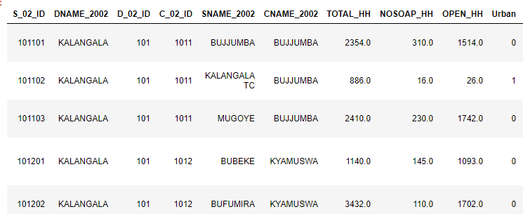
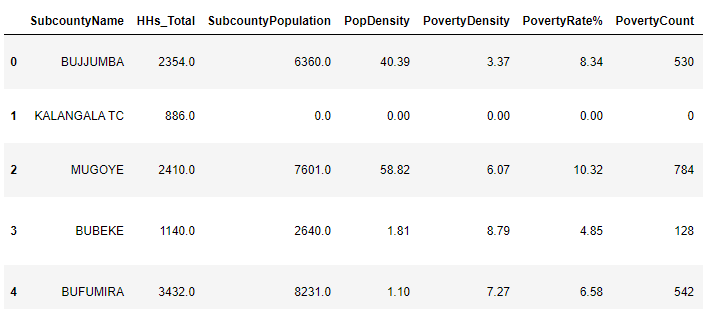
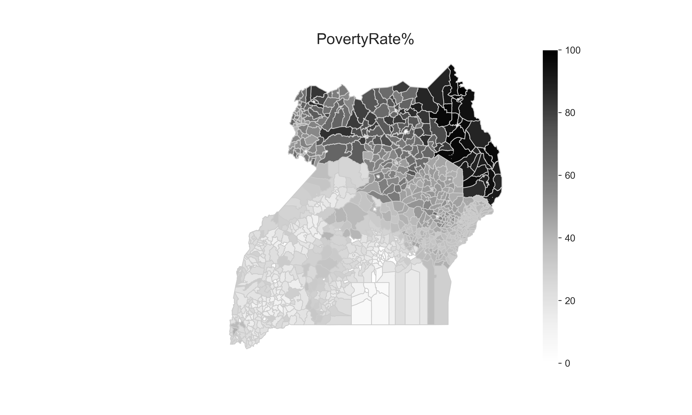
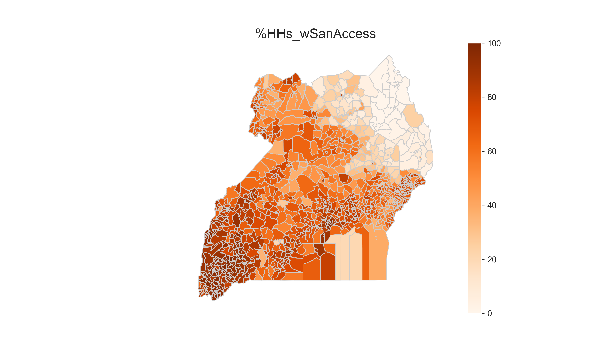
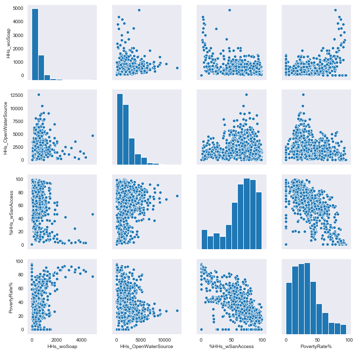
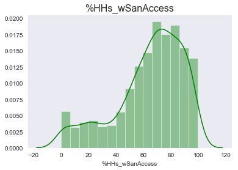
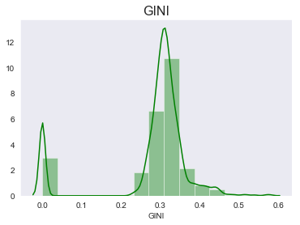
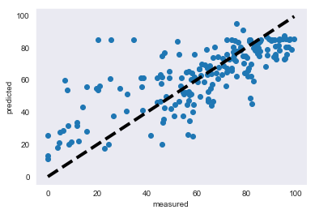
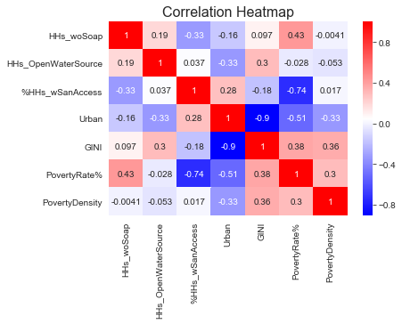
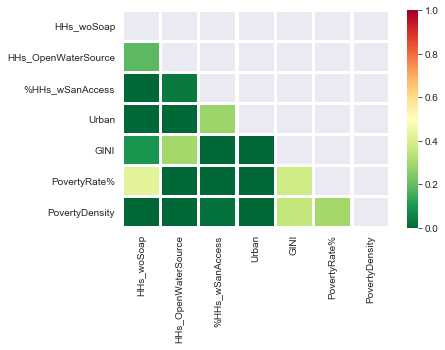

Uganda is a low-income country with low rates of access to clean water and improved sanitation. The Government of Uganda, in partnership with many international agencies, has made huge strides in recent years at reducing the rates of preventable early deaths due to risk factors like poverty, poor water quality, and inadequate sanitation. However, more work remains. With the increasing spread of technology, we have more data about the factors contributing to poor health and poverty in remote areas - raising the question, "can machine learning add value to our understanding of the issue?"

In the following article, I'll walk through how to perform Multivariate Linear Regression using Python by applying it to datasets related to poverty and W&S accessibility in Uganda. You should read this article if you:
* Are interested in problems of global poverty and development and want to know how machine learning can add insight.
* Are interested in machine learning but sick of using standard datasets like iris and the Boston housing dataset.

1. TOC
{:toc}
{:.toc-styling}

## About this tutorial
In this article, I'll discuss the goals of multiple linear regression, as well as some common traps when using it. The data requires some cleaning, so this article is also a good place to start if you are getting started working with big data sets in Python.

I'll use the following tools:
* Scikit-Learn for regression
* Pandas for basic dataframe manipulation
* Geopandas for handling and plotting shapefile data
* Matplotlib for mapping Ugandan subcounties
* Seaborn for exploring linear regression model features

Let's get started!

## Why Multiple Regression?
Linear regression is a useful method, but many real-life situations can't be boiled down into a simple, two-component system. In most real-world policy problems, it's pretty difficult to make predictions about future trends in some variable y using data from a just one variable x. This is because its usually a *bunch* of x's that bring about the occurrence seen in y. What's more, you might have a system that you know is influenced by many factors, but you're unable to distill the relative importance of each of these factors on the variable of interest.

Why would you need multiple variables? Basically, when domain expertise and past experience has indicated that they might be useful. For those who study poverty, its no surprise to hear that its root causes are multifaceted and likely a function of many different factors. One of the main advantages of multivariate linear regression is that it gives you a rough estimate of the relative importance of each factor. Benefits such as this make it stronger than simple linear regression, but you should also be careful of its weaknesses, which can lead one to misleading conclusions.

 

**Pros and Cons of Multiple Linear Regression**

| Advantages     | Disadvantages    |
| :------------- | :------------- |
| Highlights the relative influence of predictor variables | Inadequately cleaned data is likely to give misleading results |
| You don't have to base your analysis on the (arbitrary) choice of a single feature | Tendency to falsely conclude that correlation is a causation |
| May produce better predictive capability with several variables included | High danger of misinterpretation |

# PART I: Understanding the Uganda Data
The datasets were obtained from the [World Resources Institute](https://www.wri.org/resources/data-sets/uganda-gis-data), which tracks features related to poverty and the environment around the globe. The data we're using are broken down per subcounty for the year 2002. We're interested in the following features:
* Subcounty name and identification code
* Total number of households (HHs)  
* Number of HHs without soap
* Number of HHs that rely on open sources of water for drinking water
* Urban: 0 = rural subcounty; 1 = urban subcounty
* Percent of HHs with access to improved sanitation
* GINI: 0 = total equality; 1= total inequality
* Poverty rate (%)
* Number of poor in subcounty
* Poverty density in subcounty (number of poor people per square km)

Let's begin by retrieving the two datasets (one focused on environmental health and the other on rural poverty). In the following blocks of code, we'll merge the two sets based on their Subcounty Identification Code, drop the columns we're not interested in, and rename the remaining columns so that they are easier to read. Importantly, each of these datasets are spatial (shapefile) datasets, so we'll use GeoPandas to deal with them. If you're already familiar with pandas - GeoPandas is extremely similar except it contains the added ability to work with shapefile information, making it easy to map and plot data.


# Import packages
import pandas as pd
import geopandas as gpd
import matplotlib.pyplot as plt
%matplotlib inline

# Read in geodataframes using geopandas
gdf_health = gpd.read_file("Ug_Environmental-health_Census2002")
gdf_poverty = gpd.read_file("Ug_Rural-Poverty2005")

# Note that the two geodataframes have some repeat columns. Here, I remove the repeat ones (except 'S_02_ID') before merging
cols_to_use = gdf_poverty.columns.difference(gdf_health.columns)
list_cols_to_use = list(cols_to_use)
list_cols_to_use.append('S_02_ID')
gdf_poverty2=gdf_poverty[list_cols_to_use]

# Merge geodataframes based on shared column 'S_02_ID'
df_merged= gdf_health.merge(gdf_poverty2, on='S_02_ID')
df_merged.head()


Which produces the following geodataframe:

 

Nice! The information has been consolidated into a single geodataframe. But - we have many columns that we don't need, and we'd like to rename the columns to keep so they are a little more reader-friendly.


# Rename geodataframe columns by name
df_renamed = df_merged.rename(index=str, columns={
    "SNAME_2002":"SubcountyName",
    "TOTAL_HH":"HHs_Total",
    "NOSOAP_HH":"HHs_woSoap",
    "OPEN_HH":"HHs_OpenWaterSource",
    "lat_prct":"%HHs_wSanAccess",
    "NINDIVIDUA":"SubcountyPopulation",
    "FGT0":"PovertyRate%",
    "pov_count":"PovertyCount",
    "pov_dens":"PovertyDensity",
    "pop_dens":"PopDensity"})

# Get a subset of interesting columns/drop extra columns
df_subset = df_renamed[["SubcountyName",  "HHs_Total", "SubcountyPopulation", "PopDensity", "PovertyDensity", "PovertyRate%", "PovertyCount", "GINI", "HHs_woSoap", "HHs_OpenWaterSource", "%HHs_wSanAccess", "Urban", "geometry"]]


This produces the smaller, easier-to-read table:

 

## Visualizing the shapefile information
You can already get a simple idea of your geodataframe simply by typing in `df_subset.plot()`. However, I'm going to walk through how to get a nicer figure - one that is functional and more reusable.


## Make a plot function
def create_feature_map(gdf, feature_name, feature_min=0, feature_max=100, color_style="Greys", save=False):
    """
    Creates a map based on a given geodataframe and column of interest
    gdf: geodataframe containing geometry
    feature_name: column of interest to be visualized
    feature_min, feature_max: min/max ranges of feature for color-coding
    color_style: What color style to use?
    save: pass True to save as .png file (default: False)
    """

    fig, ax = plt.subplots(1, figsize=(10, 6))
    gdf.plot(column=feature_name, cmap=color_style,
                   linewidth=0.8, ax=ax, edgecolor="0.8")

    # Optional styling
    ax.axis("off")
    ax.set_title(str(feature_name),
                 fontdict={"fontsize": "16"},y=-10)

    # Create colorbar legend object and an empty array for the data range
    feature_colorbar = plt.cm.ScalarMappable(
                    cmap=color_style, norm=plt.Normalize(
                    vmin=feature_min, vmax=feature_max))
    feature_colorbar._A = []
    #add colorbar to the map
    cbar = fig.colorbar(feature_colorbar)

    if save == True:
        fig.savefig("Map_{}.png".format(feature_name), dpi=300)


We can then re-use this function to check out how different features of our dataset are distributed spatially, for example:

create_feature_map(df_subset, feature_name="PovertyRate%", color_style="Greys")


Produces the following visualization of Uganda's subcounties:

And by passing in a different string to `color_style=`, you can easily test different color maps (see [here](https://matplotlib.org/3.1.0/tutorials/colors/colormaps.html) for a full list of available schemes).

And this line of code produces a map showing household access to improved sanitation per subcounty:


create_feature_map(df_subset, feature_name="%HHs_wSanAccess", color_style="Oranges")


The northeastern region of Uganda distinctly jumps out as being the poorest. We can also tell that this region is least likely to have access to improved sanitation, as mapping both variables produces opposing images of one another. This matches with our intuition, since we'd expect that the poorest households also have the least accessibility to improved sanitation.

But what if we didn't have a full dataset that showed us the data for every subcounty. How would be able to make decisions when we don't have all the information? With machine learning, we want to find out how precisely we might be able to predict the sanitation access rates for any particular region in Uganda, given factors like its poverty rate and urbanity? Multivariate linear regression may be a useful tool in such cases.

# PART II: Multiple Linear Regression
Multivariate linear regression is the same as single linear regression, except that more than one explanatory variable is used to gain insight on the dependent variable. This technique can be thought of simply as performing regular linear regression multiple times, so the five steps that we used in this earlier [linear regression tutorial](/linear-regression-python/) are have not changed:
- Step 1. Prepare / visualize data
- Step 2. Divide into attributes and labels
- Step 3. Split into 80% train and 20% test data
- Step 4. Fit model on the training data
- Step 5. See how well it performed

### Step 1. Prepare / visualize data
Data preparation is one of the most frustrating and crucial parts of your entire machine learning pipeline. Small discrepancies in the data may be greatly amplified during the training and testing processes, causing misleading results. Preparing the data includes tasks like fixing string values, dealing with missing data points, and addressing corrupted values or extreme outliers.

Fortunately, the data we're working with contains no missing values, and we can right away begin plotting. A great first-brush visual for multivariate problems is a [pairplot](https://seaborn.pydata.org/generated/seaborn.pairplot.html), which is easy to create with the help of seaborn.


sns.pairplot(df_subset[["HHs_woSoap", "HHs_OpenWaterSource", "%HHs_wSanAccess", "PovertyRate%"]])


This type of plot is useful for quickly identifying if a linear relationship exists between the variables of interest. I often use the pairplot to get a holistic understanding of my data, then zoom in on particular relationships.

### Zoom in on a single variable
Histograms are one method for diving deeper into understanding a single variable. A histogram separates the data into bins (packages like seaborn do a pretty good job of guessing the number of bins for you, although you can always override this manually). The `displot()` function in seaborn also allows you to easily fit a kernel density estimate (KDE) to a histogram.


sns.distplot(smaller_dataset['%HHs_wSanAccess'], bins=15, color="g").set_title('%HHs_wSanAccess', size=16)


{:.post-img-smaller}

Another interesting variable to zoom in on is the GINI index. The GINI measures the degree of household income inequality in an area. For this dataset, a value of 0 indicates that there is no inequality and a value of 1 means that there is complete inequality. What values occur most frequently in our dataset?


sns.distplot(smaller_dataset['GINI'], bins=15, color="g").set_title('GINI', size=16)


{:.post-img-smaller}

It appears that the data are bisected, with some subcounties hovering around nearly complete equality (GINI = 0) and most of the remaining subcounties around a GINI inequality level of 0.3 - 0.4.

## Step 2. Divide into *attributes* and *labels*
Once you have prepared the data, the second step is to divide it into “attributes” and “labels”. **Attributes** are the explanatory variables of our dataset. In machine learning, these are often referred to as the *features* or input variables. For multiple linear regression its best not to use the term "independent variables" when talking about the explanatory variables, since at this point we can't know if they are actually independent of each other. Regardless, we are trying to use them to *explain* changes in the response.  Accordingly, the **label** refers to the dependent variable. This is also known as the *response* variable and it is the thing we are trying to predict. For this example, we will use a few different attributes - including poverty rate and GNI - to try and predict the label %HHs_wSanAccess.


multivariate_X = smaller_dataset[['PovertyRate%', 'HHs_OpenWaterSource', 'Urban']].values
multivariate_y = smaller_dataset['%HHs_wSanAccess'].values


## Step 3. Split into 80% train and 20% test data
An easy way for machine learning projects to go awry is by using training data to test how good a model's predictions were. This is analogous to student's learning from teachers who "teach to the test". Of course if a teacher drills test answers into students' heads, they'll do pretty well when asked the same exact question during an examination. But just because the entire class has earned A's, doesn't really mean that these students have learned the material and would be able to apply the lessons to new material they'd never seen before.

This is exactly why analysts set aside a certain portion of the data to use later for testing. It is important that the model hasn't seen this data before, else the test will not be true.

The Train-Test-Split process is extremely easy to conduct with the help of Scikit-Learn (make sure you understand the mathematics behind this though!). Failure to appropriately split the data for training can quickly lead to *poor generalization*, where model is over-trained to a particular dataset and functions poorly on new (unseen) data.


## split into test and train data
X_train, X_test, y_train, y_test = train_test_split(multivariate_X, multivariate_y, test_size=0.2, random_state=0)


## Step 4. Fit model on the training data
Training the Linear Regression model is straightforward with the help of Scikit-Learn. We can instantiate the `LinearRegression()` attribute, which takes in its `fit` method an X and y array that represents the attribute and feature data. It stores the coefficients of the linear model inside `coeff_` attribute so that we can quickly access it later.


## Train the model
regressor = LinearRegression()  
regressor.fit(X_train, y_train)


Creating the multiple regression model with Scikit-Learn generally requires just a few lines of code. However, it is important to choose appropriate parameter values to instantiate the model in a way that will produce accurate results. Learning how to appropriately set these parameters requires a great deal of time, experience, and testing - so don't be afraid to experiment!

## Step 5. See how well the model performed
There are a number of ways to interpret the value of the predictions we obtained from the model. In the case of multiple regression, the goal of our model is to find the most optimal coefficients for all the attributes. To see what coefficients our regression model has chosen, we can plot our predictions versus the actual measurements by executing the following:


predictions = regressor.predict(X_test)

fig, ax = plt.subplots()
ax.scatter(y_test,predictions)
ax.plot([y_test.min(), y_test.max()], [y_test.min(), y_test.max()], 'k--', lw=4)
ax.set_xlabel('measured')
ax.set_ylabel('predicted')
plt.show()


{:.post-img-smaller}

Pretty good! From this plot, we can see that the outcome follows a linear trend, which means our model fit was appropriate. Using this easy visualization, we can quickly see that our predictions generally followed our actual measurements. Just like with single linear regression, we do not want to see curvature in this plot, since it may indicate that a linear model was an inappropriate fit or that a transformation is required.

But how good was the model, really? In the final step of this article, we will evaluate the performance of the algorithm (quantitatively). We can do this by calculating the values for common predictive metrics such as: MAE, MSE, and RMSE.


print('The MAE is:', metrics.mean_absolute_error(y_test, y_pred).round(3))  
print('The MSE is:', metrics.mean_squared_error(y_test, y_pred).round(3))  
print('The RMSE is:', np.sqrt(metrics.mean_squared_error(y_test, y_pred)).round(3))
print('   Since the mean is', np.mean(y_test).round(3), 'your RMSE should probably be below', 0.1*np.mean(y_test).round(3))


For more information about the use of such metrics, see [this](/linear-regression-python/) article. One quick rule of thumb though, is to keep your RMSE below 10% of the mean.

#### Dealing with Multicollinearity
When applying machine learning, we often want to know not just "does a relationship exist?" but "how strong is this relationship?" The amount of influence that the group of features holds over the label depends on their level of correlation.

It is important to keep in mind that if we remove one of the variables from consideration, the correlation values for the remaining terms will change. In other words, due to shared variance the ability of the x variables to explain changes in y must be adjusted whenever the equation changes.

<!-- Returning to looking at multiple variables, we can easily create a correlation plot:

sns.heatmap(smaller_dataset.corr(),annot=True, cmap='bwr').set_title('Correlation Heatmap', size=16)


{:.post-img-smaller} -->


cor_df=smaller_dataset.corr(method='pearson')
mask= np.zeros_like(cor_df)
mask[np.triu_indices_from(mask)]=True

sns.heatmap(cor_df, cmap='RdYlGn_r', vmax=1.0,
            vmin=0,mask=mask, linewidths=2.5)
plt.yticks(rotation=0)
plt.xticks(rotation=90)
plt.show()


Which produces the following:
{:.post-img-smaller}

When fitting a model, you may find that some of your explanatory variables in the regression are highly related to each other. Because of this, they do not provide unique/independent information. This **multicollinearity** occurs when you have several variables that are correlated with one another. This essentially leads to using the same variance more than once to explain changes in y. As a whole, multivariate regression can be useful even when the features are collinear, since it gives you an idea of how the whole group of features predicts the outcome of interest. For any individual feature, however, the results may not be valid.

If you are most interested in understanding the strength of particular coefficients, then you should be concerned about the influence of multicollinearity. However, if you are more interested in seeing how well the entire group of variables explains changes in y, then less concern is warranted. In general, if you want to counteract multicollinearity there are three main options: (1) removing some of your explanatory variables, (2) gathering more data, or (3) using mathematics to "center" the data i.e. adjust for multicollinearity.

<!--
What does this figure tell us?

### Looking at R2
- `r2_score(y_test, y_pred)` (remember, the closer the r2 is to 1, the better)
- "How much variance is explained? As in simple linear regression we can determine the faction of variance explained by the regression. In simple linear regression this value was called the coefficient of determination and denoted r2.  In multiple linear regression we calculate R2 the coefficient of multiple determinatio"
- " In the regression analysis, we can see the report of analysis of variance, showing the approximate percentage of predictor’s
account for criterion (dependent variable). For example, the predictors account for 60% of the variance of criterion variable
(when R2 is .60)."

### Mapping/visualization
- once you start working with more than two variables at the same time, the analysis immediately becomes more difficult. Many of the standard tools you may have relied on previously are no longer powerful enough.
- The field of multi-dimensional visualization is an ongoing domain of research
- while i can make a nice map of the uganda data, I cant map anything sensible for many variables at once.
- the problem is that people often try to cram more and more data into one figure, so that it ends up becoming crowded and difficult to interpret. With point markers of different sizes and colors for instance, its hard to see interesting behavior
 -->

# Conclusion
Multivariate Linear Regression is one an extremely useful algorithm for tracking the relationships of continuous variables. It is also one of the most commonly used algorithms in machine learning, so it pays to familiarize yourself with it.

Now that you understand the theory behind linear regression and have seen an example of its use on a real dataset, you should try implementing it on different datasets to get a feel for it. You may also want to look into the other regression algorithms and to see if adding or removing features improves the accuracy of the model.

Today, the number of Ugandans with access to sanitation infrastructure “remains abysmally low,” as only 14% of households have access to improved sanitation (World Bank Group, 2016). Tools such as multiple linear regression may help analysts gain insight into the problem, where more than one parameter is needed to explain the variable of interest.

<!--
- Hirai et al. (2016), note that the majority of children do not have a location to wash their hands and 41% of children live in households where water collection time is greater than 30 minutes, which are both significant risk factors for disease.
- " In past tens of years, researchers have used this multiple regression analysis as a powerful tool because it allows to model statistically the relationship between dependent variable and a set of independent variable. Linear regression is used with continuous dependent variables, while logistic regression is used with dichotomous variables"
- "A good practice that is true for every software, but especially in machine learning, is to make every step of your project reproducible. It should be possible to start the project again from scratch and create the same exact split between train, dev and test sets. We need to make sure that any randomness involved  uses a fixed seed so that every call will result in the same output."
- "poor generalization is often characterized by over-training. A common method to avoid over-training is the hold-out crossvalidation. The basic problem of this method represents, however, appropriate data splitting. In most of the applications, simple random sampling is used."

- "At the center of the multiple linear regression analysis lies the task of fitting a single line through a scatter plot.  More specifically, the multiple linear regression fits a line through a multi-dimensional cloud of data points"
Our model has returned predictions that are pretty close to the actual results. -->
